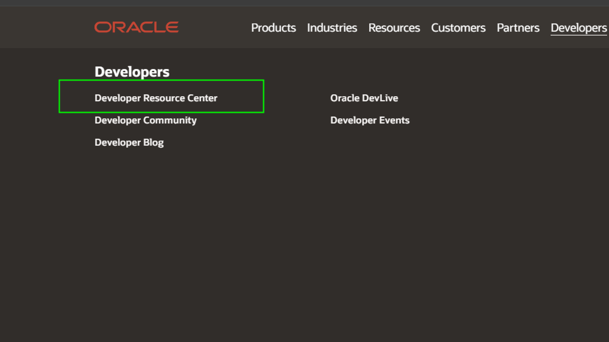
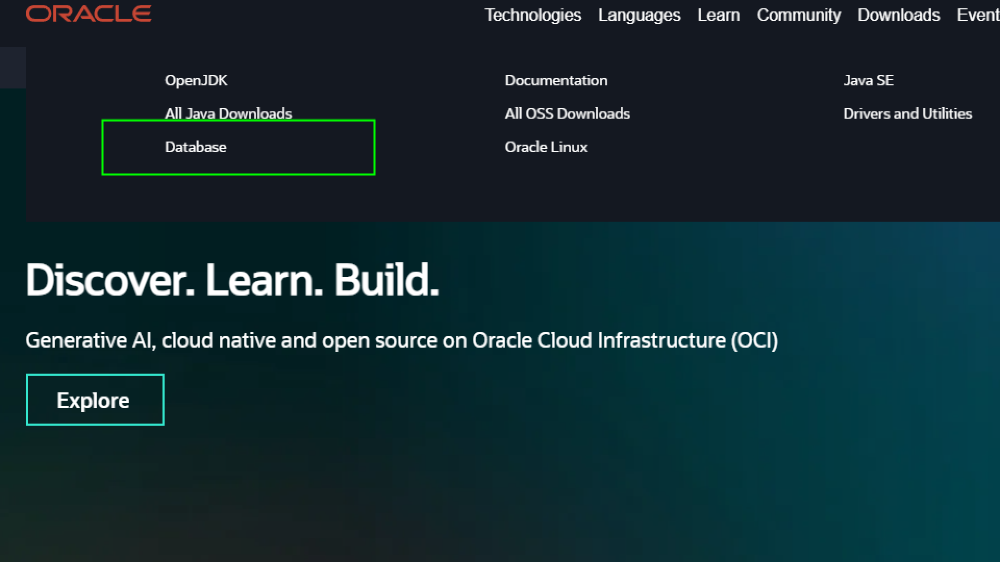

# 오라클 DBMS

## 오라클 다운로드

### https://oracle.com 접속

### developers 메뉴

### developers Resouce center 메뉴

### downloads 메뉴

### database 항목

### Datbase Express Edition 항목

### Oracle 21c Windows x64 다운로드

### SQL Developer

### JDK include 버전 다운로드

# 오라클 DBMS 의 특징

- 오라클 DBMS 는 사용자 = 데이터 저장소 가 되어 DBMS 에 접속(Login)한 사용자는 자신의 DB에만 보통 접근이 가능하다
- 오라클은 DB 저장소개념으로 TableSpace 라는 것을 사용한다.
- 오라클의 TableSpace 는 접속한 사용자 관리하는 파일의 개념으로 본다.

## TableSpace

- 오라클은 데이터저장소의 물리적 명칭을 TableSpace 라고 한다.
- TableSpace 는 파일형식으로 구성이 되며, 오라클 DBMS 소프트웨어에 의해 관리된다.
- 오라클 DBMS 소프트웨어를 처음 설치하면 System TableSpace 만 있는 상태이다.
- 여기에 만약 Table 등을 생성하면, 모든 데이터가 System Data 영역에 저장이 되고, 보안 관리 측면에서 좋지 않은 결과를 낼수 있다.
- 오라클에서는 프로젝트를 수행할때 제일먼저 `TableSpace` 라는 것을 생성해 주어야 한다.
- 그리고 사용자 생성을 할때 새로 생성한 TableSpace 와 연결해주는 절차가 필요하다
